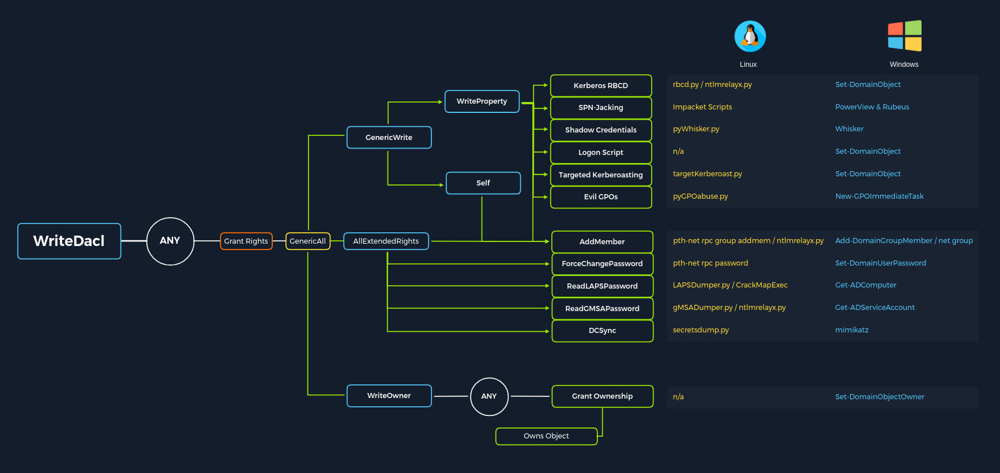

# Abusing ACLs

* `ForceChangePassword` abused with `Set-DomainUserPassword`
* `Add Members` abused with `Add-DomainGroupMember`
* `GenericAll` abused with `Set-DomainUserPassword` or `Add-DomainGroupMember`
* `GenericWrite` abused with `Set-DomainObject`
* `WriteOwner` abused with `Set-DomainObjectOwner`
* `WriteDACL` abused with `Add-DomainObjectACL`
* `AllExtendedRights` abused with `Set-DomainUserPassword` or `Add-DomainGroupMember`
* `Addself` abused with `Add-DomainGroupMember`

<figure><figcaption></figcaption></figure>

ACL attacks:

* [ForceChangePassword](https://bloodhound.readthedocs.io/en/latest/data-analysis/edges.html#forcechangepassword) - gives us the right to reset a user's password without first knowing their password (should be used cautiously and typically best to consult our client before resetting passwords).
* [GenericWrite](https://bloodhound.readthedocs.io/en/latest/data-analysis/edges.html#genericwrite) - gives us the right to write to any non-protected attribute on an object. If we have this access over a user, we could assign them an SPN and perform a Kerberoasting attack (which relies on the target account having a weak password set). Over a group means we could add ourselves or another security principal to a given group. Finally, if we have this access over a computer object, we could perform a resource-based constrained delegation attack which is outside the scope of this module.
* `AddSelf` - shows security groups that a user can add themselves to.
* [GenericAll](https://bloodhound.readthedocs.io/en/latest/data-analysis/edges.html#genericall) - this grants us full control over a target object. Again, depending on if this is granted over a user or group, we could modify group membership, force change a password, or perform a targeted Kerberoasting attack. If we have this access over a computer object and the Local Administrator Password Solution (LAPS) is in use in the environment, we can read the LAPS password and gain local admin access to the machine which may aid us in lateral movement or privilege escalation in the domain if we can obtain privileged controls or gain some sort of privileged access.

